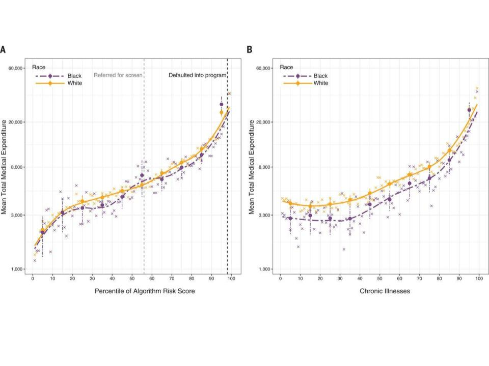
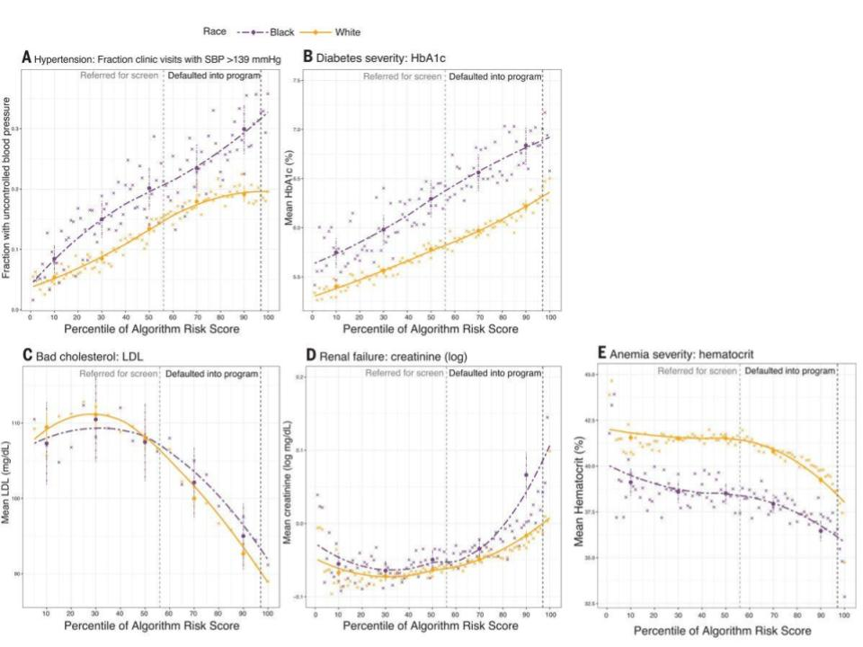
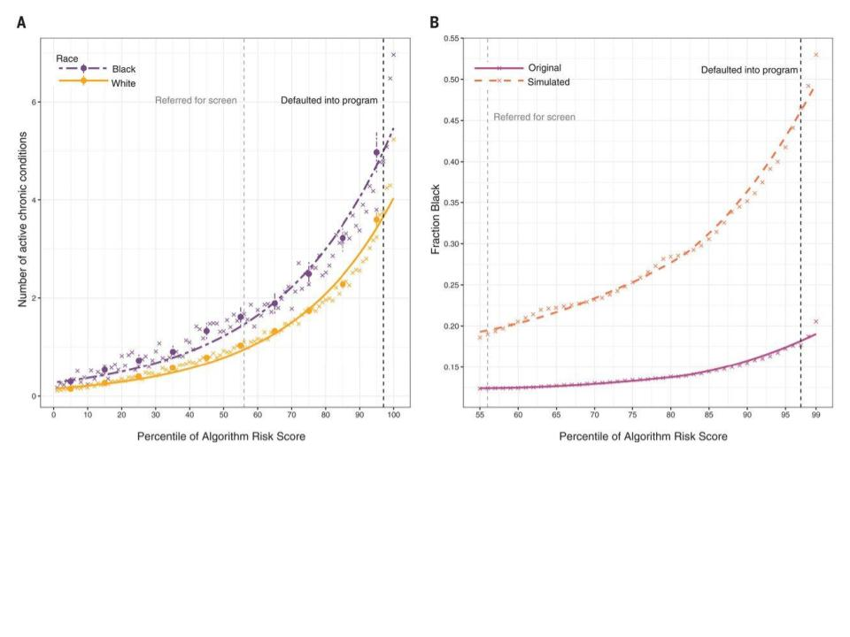
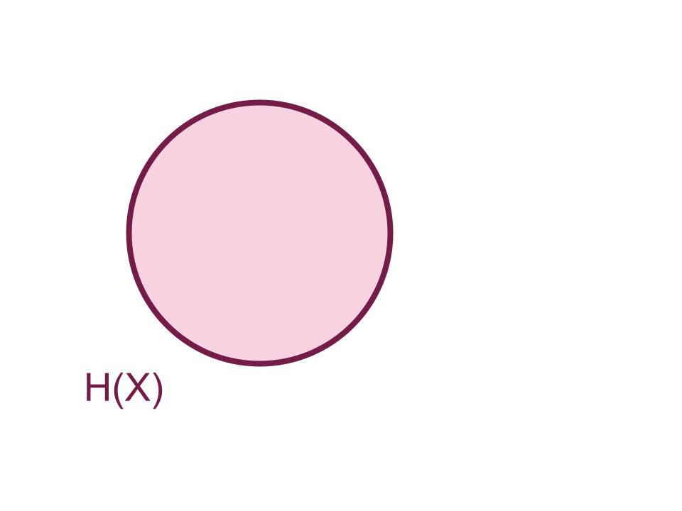
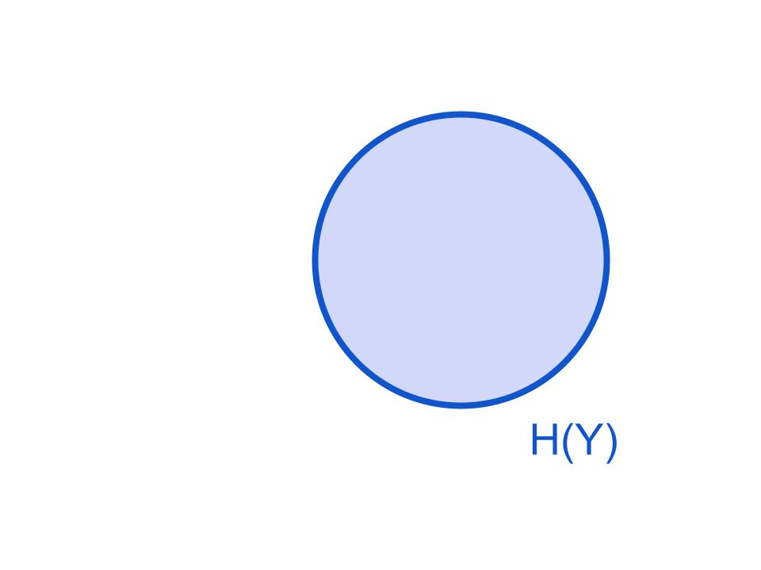
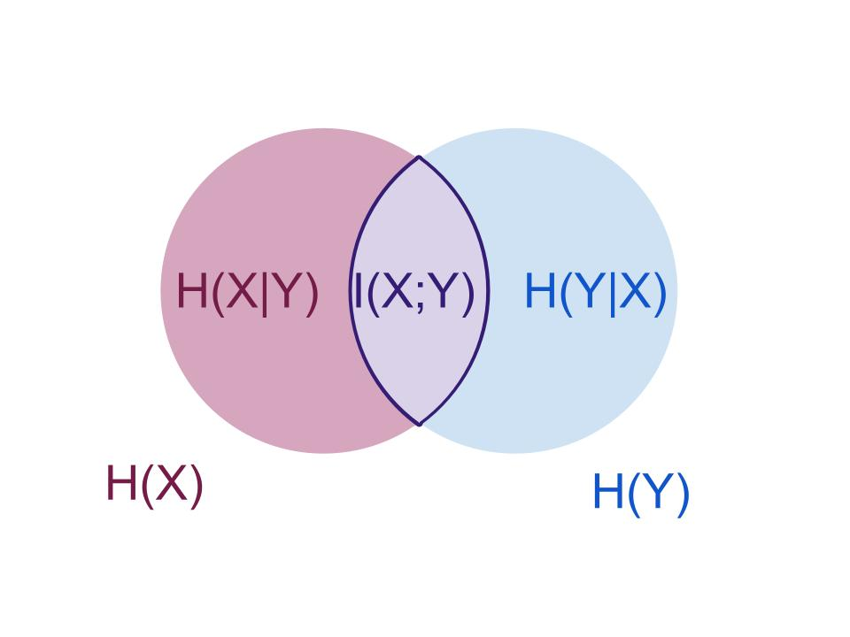
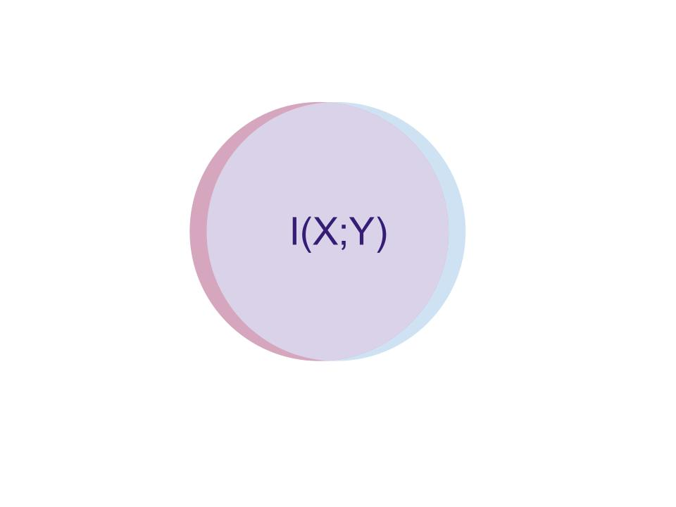
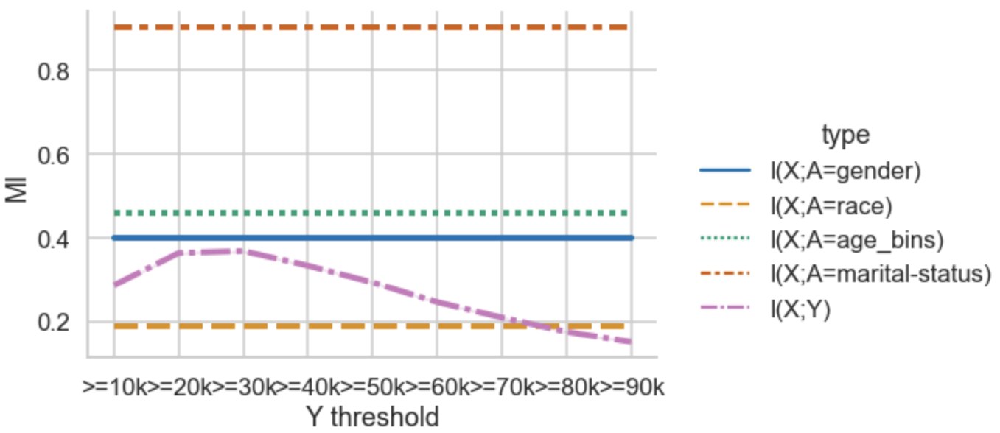
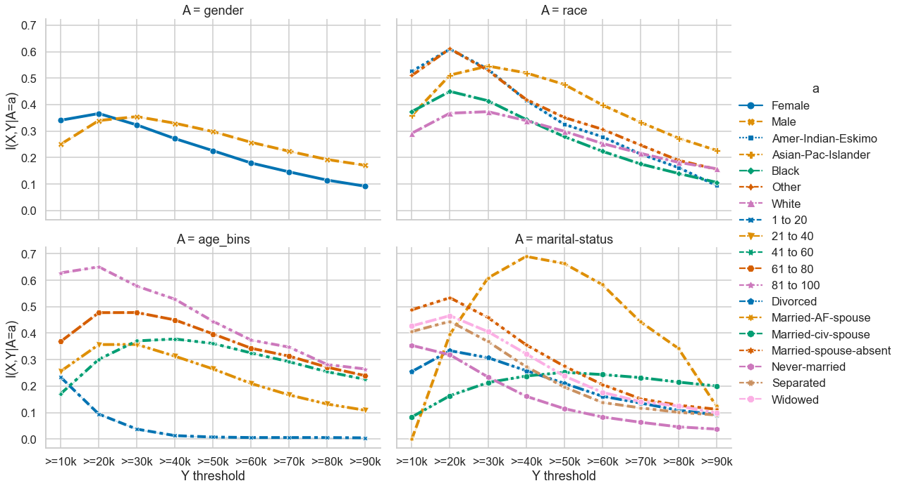
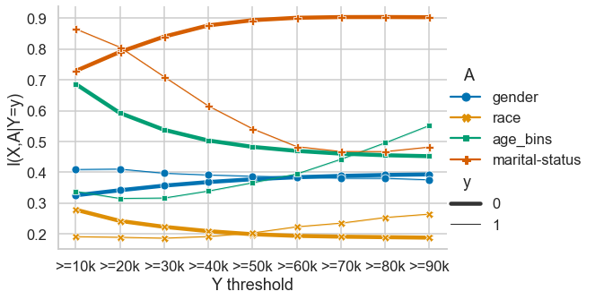

```{slide} Assessing Machine Learning Problems for Fairness Before Fitting"
:class: title

### Sarah M Brown
#### University of Rhode Island
*joint work with Surbhi Rathore*

```

```{slide} Why Fairness in Machine Learning?

- COMPAS
- GenderShades
- Obermyer

```


```{slide} Algorithmic Fairness Interventions


### Typical approaches:

- blame the data, not my problem <!-- .element: class="fragment fade-in-then-semi-out" -->
- repair the data (preprocessing) <!-- .element: class="fragment fade-in" -->
- alter the learning (inprocessing) <!-- .element: class="fragment fade-in" -->
- change how the model is used  (postprocessing) <!-- .element: class="fragment fade-in" -->


```

```{slide} An Alternative Proposal 

> reformulate the problems that we apply AI to so that they are better suited to producing socially acceptable outcomes

```


````{slide} Why reformulate?



````


````{slide} 

````


````{slide} 


````


````{slide} How do we know when to reformulate?

To do this: propose computationally efficient information theoretic quantities for evaluating problem setups

````


````{slide} Agenda:

1. Information Theory
<!-- (background) -->
2. AI Tasks
<!-- (setup) -->
3. Information theoretic task fairness
<!-- (main contribution) -->
4. Experiments
<!-- (validation) -->

````


````{slide} Information Theory

````


````{slide} Information Theory



````


````{slide} Information Theory



````


````{slide} Information Theory



````


````{slide} Information Theory



````


````{slide} Formally

$$\operatorname{I}(X;Y) =  \sum_{x,y} p(x,y) \log \frac{p(x,y)}{p(x)p(y)} $$

$$\operatorname{I}(X;Y) = \operatorname{D_{KL}}(p(X,Y) || p(X)p(Y) ) $$

````


````{slide}  Conditional MI

$$\operatorname{I}(X;Y|Z) &=\sum_z p(z)  \sum_{x,y} p(x,y|z) \log \frac{p(x,y|z)}{p(x|z)p(y|z)} $$


Independence: $\operatorname{I}(X;Y) =  0$


````


````{slide}  Tasks in AI  and ML


````


````{slide} Let's predict concept $Z$ !


*idealized task*: a prediciton target concept, $Z$

````


````{slide}  Can we even do that theoretically?


an idealized task is plausible if there exist some set of features $X^*$ that can be used to for prediction

$$ \operatorname{I}(X^*; Z) = 1- \epsilon$$

````


````{slide} But can we *really* do that?

a *realized* task include measurable features $X$ and a measurable proxy target $Y$

````


````{slide} ML Tasks

- Idealized task: predict $Z$ (latent)
- Plausible Task: predict $Z$ from $X^*$ (possibly immeasurable or expensive)
- Realized task: predict $Y$ (observed) from $X$ (observed), interpret as $\hat(Y)$ as $Z$

````


````{slide} Information Theoretic Task Fairness
:class: section

````


````{slide} Classical Fairness Criteria

- Independence: $\operatorname{I}(A;\hat{Y}) = 0$
- Separation: $\operatorname{I}(A;\hat{Y}|Y) = 0$
- Sufficiency: $\operatorname{I}(A;Y|\hat{Y}) = 0$

````


````{slide} Classical Fairness Criteria in Realized Tasks

- Feature Independence: $\operatorname{I}(A;X) = 0$
- Proxy Independence: $\operatorname{I}(A;Y) = 0$
- Separation: $\operatorname{I}(A;X|Y) = 0$
- Sufficiency: $\operatorname{I}(A;Y|X) = 0$

````


````{slide} Approximations

#### Informative Beyond Demographics

$$ \operatorname{I}(Y;X) > \operatorname{I}(A;X )$$

### Group-wise Uniformly Informative Beyond Demographics

$$ \operatorname{I}(Y;X|A=a) > \operatorname{I}(A;X ) \forall a \in A$$

````


````{slide} Equality of Information

$$ \operatorname{I}(Y;X|A=a_1) - \operatorname{I}(Y;X|A=a_2) < \epsilon $$


````


````{slide} Estimating Distributions


In tabular data, histogram estimates of density make MI easy to calculate.

Number of bins does not impact the information theory **comparisons**

*in nondegenerate cases, in these datasets*

````


````{slide} Obermeyer


Information gap (black vs white) is larger for costs than for Number of chronic illnesses


````


````{slide} Adult Reconstruction

- Ding et al reconstructed the Adult dataset from source
- many features about 70k people
- continuous valued income instead of >50k binary
- they found that different binary prediction problems have different fairness

````


````{slide} Informative beyond Demographics?



````


````{slide} Equality of Information?



````


````{slide} Separation ?




````


`````{slide} What are the parts of an ML problem? 

[](https://mermaid.live/edit#pako:eNptkc-KgzAQxl9lCBTaxb6ALIUuHj2UXW_aw9RMTagmEkd2pbbPvqlxi5TNaf788s03yVWUVpKIxbm236VCx5B-Fgb86fpT5bBVkOaZQ220qY6hI7WjkrU1kH2ESpKveWZAIiO8n9wOfqIBNkfYbncwatP2DGxH2Oc1oZtQrCvrNKtmFt4H1vbs4W4EVnmLDhtict3MkJEv_rI8o47_s_e3SsLen2eW3t5encEIh3XrSOpwGas6mNtAUDkszI0wKPSqC36SHR6yT6NzxMpPeuh3LZX6PPhBobFa-ZXv9_siT6Y84WchnQrZMxeRaMg1qKX_teujXAhW1FAhYh9KdJdCFObmOezZfg2mFDG7niLRt35_SjT6d2tEfMa6o9svzpKkwQ)
<!-- ML flowchart -->
`````


```{slide} 
:class: section

> ML algorithms *write* other algorithms

```


````{slide} In other words

- learning is usually estimation
- prediction is usually inference
````


````{slide} Questions?
:class: section

brownsarahm@uri.edu
````


<!-- extra -->


<!-- 

`````{slide} Emphasize Evaluation
:class: strategy

```{panels}
in Instruction
^^^
- Frame evaluation as competing goals
````


````{slide} 
in Assignments
^^^
- Always require more than one metric
- Disaggregate by group in social data

```

```{note}

Evaluation allows students to think about problems more deeply.

Fairness issues "discovered" in ML through eval

It helps monitor, considering broader impact
```

````` -->